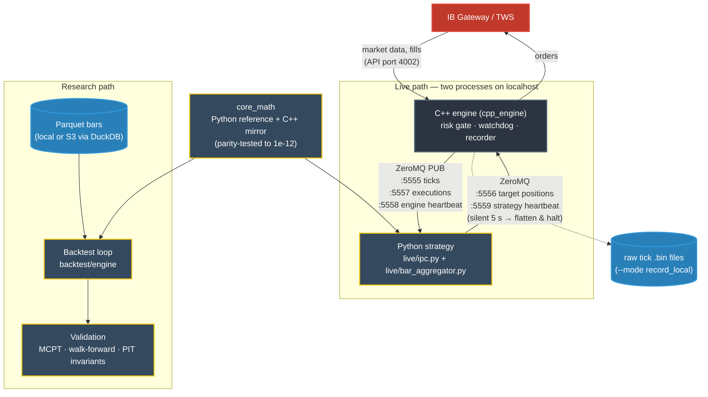

# trad_engine

**English** · [Português](README.pt-BR.md)

A self-hosted algorithmic-trading engine: a C++ market data / execution core connected
to Interactive Brokers, a pure-Python `core_math` layer that mirrors it under parity
tests, a backtest engine, and a **validation harness** (Monte Carlo permutation tests,
walk-forward, point-in-time invariants) built to catch the ways a backtest lies.

Measured, not claimed: the C++ hot path adds **0.3 µs** per tick (p50), and a full
round trip engine -> Python strategy -> engine takes **273 µs** (p50) on a laptop —
broker and network excluded, which is where the real milliseconds are
([details](#latency)). If the strategy goes silent for 5 s, the engine cancels,
flattens and refuses new orders on its own.

> **What this is not.** This is engine + method. It ships with *example* strategies
> (textbook Donchian breakout, Bollinger bands, and a microstructure template). It does
> **not** ship anyone's alpha — bring your own signal; the engine is agnostic to it.

---

## How it fits together



The same `core_math` feeds the backtest and the live strategy, so a signal is computed
by one piece of code in both places. The strategy only ever says *what position it
wants*; the engine owns the broker connection and decides whether that is allowed.

---

## Why it might be worth your time

Three design decisions do most of the work here, and they are the reason the code is
worth reading even if you never run it:

1. **A Python reference and a C++ mirror, locked by parity tests.**
   `core_math` exists twice: a readable Python implementation (the ground truth) and a
   fast C++ implementation (the hot path). A parity test (`tests/test_cpp_parity.py`)
   compiles the mirror and asserts it matches the reference to within 1e-12 — not
   bit for bit, because pandas and the C++ loops sum in a different order, but ~1000x
   tighter than any real formula drift. You get C++ speed in production without giving
   up a researchable, debuggable reference, and the two cannot silently drift apart.

2. **Models frozen as data, not as pickles.**
   A trained linear/logistic classifier is frozen into ~30 plain floats (coefficients,
   scaler stats, feature order, threshold) and applied with a sigmoid and no sklearn
   dependency (`core_math/meta_model.py`). That makes a decision **reproducible** across
   processes and across library versions: a separate verifier can reproduce the exact
   same probability — the same decision fingerprint — as the trainer. A pickled model
   cannot promise that.

3. **Causality is a first-class invariant, not a hope.**
   Every primitive documents that the value at time *t* uses only data at or before *t*.
   The validation layer includes point-in-time invariant checks, and CI runs them
   against every primitive (`tests/test_causality.py`): perturb the future, and nothing
   at or before *t* may change. The checkers are themselves tested against planted
   leaks, so lookahead fails loudly instead of quietly inflating a backtest.

---

## Layout

```
trad_engine/
├── cpp_engine/          # low-latency C++ core: market-data ingest, IPC, execution
│   ├── include/         #   arena allocator, IPC structs, contract factory
│   └── src/
├── lib/client/          # (you populate this — see lib/client/README.md)
├── core_math/           # pure, causal compute primitives
│   ├── bars_math.py     #   returns, SMA/EMA, ATR, RSI, z-score, realized vol …
│   ├── micro_math.py    #   BVC signed volume, volume buckets, VPIN, TIB
│   ├── labeling.py      #   triple-barrier labeling (López de Prado)
│   ├── meta_model.py    #   apply a frozen linear model as data
│   └── cpp/             #   the C++ mirror of the microstructure math
├── backtest/
│   ├── engine/          # the backtest loop + trade metrics
│   ├── validation/      # MCPT, walk-forward, bar-permutation, PIT invariants
│   └── strategies/      # example strategies (bring your own for real use)
├── live/                # trades -> bars, and the Python side of the engine's IPC protocol
├── examples/            # runnable end-to-end paper-trading demo
├── benchmark/           # reproducible latency / throughput numbers
└── tests/               # parity, causality, bar rules, validation mechanics
```

## Requirements

- **Python** ≥ 3.11 — `pip install -r requirements.txt` (numpy, pandas, scipy).
- **C++17** toolchain + CMake, only if you build `cpp_engine`.
- **Interactive Brokers TWS API** — *not vendored here* (see below).

### The IBKR API is not included, on purpose

`cpp_engine` talks to Interactive Brokers through the TWS API. Interactive Brokers'
API code is **copyrighted and cannot be redistributed** ("All rights reserved", IB API
License), so this repo does not ship it. Populate `lib/client/` yourself — instructions
and the credit to the community C++ wrapper this integration was built against are in
[`lib/client/README.md`](lib/client/README.md).

## Quickstart

```bash
pip install -r requirements.txt

# run the end-to-end paper-trading demo (replay feed → bars → example strategy
# → simulated fills → journal), no broker or market data account needed:
python -m examples.paper_demo

# validate a strategy the honest way (Monte Carlo permutation test, walk-forward):
python -m backtest.engine.backtest --help

# run the test suite (the C++ parity tests need g++/clang++ on PATH, else they skip):
pip install -r requirements-dev.txt
python -m pytest
```

## Running live

The live path is two processes talking over ZeroMQ on localhost: the C++ engine (broker
connection, risk gate, watchdog) and a Python strategy. `examples/live_client.py` is a
minimal, working strategy for the other end of the protocol; `live/ipc.py` is the wire
format, checked field-by-field against the C++ structs in CI (`tests/test_ipc.py`).

```bash
# 1. build the engine (needs lib/client populated, ZeroMQ, CMake)
cmake -S cpp_engine -B build && cmake --build build
#    Windows: tested with MSYS2 UCRT64 (pacman -S mingw-w64-ucrt-x86_64-{gcc,cmake,ninja,zeromq})
#    and `cmake -S cpp_engine -B build -G Ninja`

# 2. start IB Gateway (paper account, API on port 4002), then the engine
#    no real-time data subscription? apply the delayed-data patch in lib/client/README.md
./build/trad_engine --live --mode listen_only --config examples/engine_config.example.json

# 3. start the strategy with the SAME config (dry run: prints decisions, sends nothing)
python -m examples.live_client --config examples/engine_config.example.json --ticker SPY
#    add --send-orders to actually send target positions through the engine's risk gate
```

The strategy sends **target positions**, not orders ("I want +1"); the engine turns
them into the delta against the broker's position, keeps one order in flight per
asset from the strategy's side, and flattens everything if the strategy's heartbeat
goes silent or the daily loss limit is hit.

## Latency

`python -m benchmark.latency` measures the live path tick -> order, component by
component, with every tick turned into an order (worst case). On a laptop (AMD Ryzen 5
5600H, Windows 11, Python 3.12), in microseconds:

| component | p50 | p99 | p99.9 |
|---|---:|---:|---:|
| (A) engine hot path, C++: broker callback -> arena record -> ZMQ publish | 0.3 | 0.5 | 3.2 |
| (B1) strategy framework, Python: decode -> bar -> encode | 4.1 | 7.0 | 29.7 |
| (B2) example signal (SMA cross) | 8.6 | 13.6 | 56.0 |
| (C) round trip across processes: engine -> ZMQ -> strategy -> ZMQ -> engine | 273 | 435 | 487 |

p50 is the median tick; p99 is what only 1 tick in 100 exceeds. The engine's own
contribution is dominated by the two localhost ZMQ hops and the process wake-ups in
(C), not by compute. What this does **not** include is the broker and the network
(IB Gateway <-> exchange), which are milliseconds and dwarf all of the above — so
these numbers say "the engine is not the bottleneck", not "this is an HFT stack".
They depend on the machine; rerun them on yours.

## License

MIT — see [LICENSE](LICENSE). Third-party components keep their own licenses (the IBKR
TWS API you supply is **not** MIT and is not redistributed by this repo).
