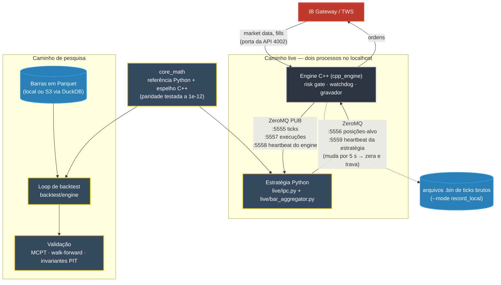

# trad_engine

[English](README.md) · **Português**

Um engine de trading algorítmico self-hosted: um núcleo C++ de market data e execução
conectado à Interactive Brokers, uma camada `core_math` em Python puro que o espelha
sob testes de paridade, um engine de backtest e um **arcabouço de validação** (testes
de permutação de Monte Carlo, walk-forward, invariantes point-in-time) feito para pegar
os jeitos como um backtest mente.

Medido, não prometido: o caminho quente em C++ adiciona **0,3 µs** por tick (p50), e
uma ida e volta completa engine -> estratégia Python -> engine leva **230 µs** (p50)
num notebook — sem contar broker e rede, que é onde estão os milissegundos de verdade
([detalhes](#latência)). Se a estratégia ficar muda por 5 s, o engine cancela as
ordens, zera as posições e passa a recusar ordens novas sozinho.

> **O que isto não é.** Isto é engine + método. Vem com estratégias de *exemplo*
> (o breakout de Donchian de livro, bandas de Bollinger e um template de
> microestrutura). **Não** vem com o alpha de ninguém — traga o seu sinal; o engine é
> agnóstico a ele.

---

## Como as peças se encaixam



O mesmo `core_math` alimenta o backtest e a estratégia live, então um sinal é
calculado pelo mesmo código nos dois lugares. A estratégia só diz *qual posição ela
quer*; o engine é dono da conexão com o broker e decide se isso é permitido.

---

## Por que pode valer o seu tempo

Três decisões de design fazem a maior parte do trabalho aqui, e são o motivo de o
código valer a leitura mesmo que você nunca o rode:

1. **Uma referência em Python e um espelho em C++, travados por testes de paridade.**
   O `core_math` existe duas vezes: uma implementação legível em Python (a verdade de
   referência) e uma implementação rápida em C++ (o caminho quente). Um teste de
   paridade (`tests/test_cpp_parity.py`) compila o espelho e verifica que ele bate com
   a referência dentro de 1e-12 — não bit a bit, porque o pandas e os loops em C++
   somam em ordens diferentes, mas ~1000x mais apertado do que qualquer divergência
   real de fórmula. Você tem a velocidade do C++ em produção sem abrir mão de uma
   referência pesquisável e depurável, e as duas não conseguem divergir em silêncio.

2. **Modelos congelados como dados, não como pickles.**
   Um classificador linear/logístico treinado é congelado em ~30 floats simples
   (coeficientes, estatísticas do scaler, ordem das features, limiar) e aplicado com
   uma sigmoide, sem depender do sklearn (`core_math/meta_model.py`). Isso torna a
   decisão **reproduzível** entre processos e entre versões de biblioteca: um
   verificador separado consegue reproduzir exatamente a mesma probabilidade — a mesma
   impressão digital da decisão — que o treinador. Um modelo em pickle não consegue
   prometer isso.

3. **Causalidade é um invariante de primeira classe, não uma esperança.**
   Toda primitiva documenta que o valor no instante *t* usa só dados de *t* ou antes.
   A camada de validação inclui checagens de invariantes point-in-time, e o CI as roda
   contra todas as primitivas (`tests/test_causality.py`): perturbe o futuro, e nada
   em *t* ou antes pode mudar. Os próprios checadores são testados contra vazamentos
   plantados, então lookahead falha alto em vez de inflar um backtest em silêncio.

---

## Estrutura

```
trad_engine/
├── cpp_engine/          # núcleo C++ de baixa latência: ingestão de market data, IPC, execução
│   ├── include/         #   alocador de arena, structs de IPC, fábrica de contratos
│   └── src/
├── lib/client/          # (você popula — veja lib/client/README.md)
├── core_math/           # primitivas de cálculo puras e causais
│   ├── bars_math.py     #   retornos, SMA/EMA, ATR, RSI, z-score, vol realizada …
│   ├── micro_math.py    #   volume sinalizado BVC, volume buckets, VPIN, TIB
│   ├── labeling.py      #   triple-barrier labeling (López de Prado)
│   ├── meta_model.py    #   aplica um modelo linear congelado como dados
│   └── cpp/             #   o espelho C++ da matemática de microestrutura
├── backtest/
│   ├── engine/          # o loop de backtest + métricas de trade
│   ├── validation/      # MCPT, walk-forward, permutação de barras, invariantes PIT
│   └── strategies/      # estratégias de exemplo (para uso real, traga as suas)
├── live/                # trades -> barras, e o lado Python do protocolo IPC do engine
├── examples/            # demo de paper trading ponta a ponta, pronta para rodar
├── benchmark/           # números reproduzíveis de latência / throughput
└── tests/               # paridade, causalidade, regras de barra, mecânica da validação
```

## Requisitos

- **Python** ≥ 3.11 — `pip install -r requirements.txt` (numpy, pandas, scipy).
- Toolchain **C++17** + CMake, só se você for compilar o `cpp_engine`.
- **TWS API da Interactive Brokers** — *não incluída aqui* (veja abaixo).

### A API da IBKR não vem no repo, de propósito

O `cpp_engine` conversa com a Interactive Brokers pela TWS API. O código da API da
Interactive Brokers é **protegido por copyright e não pode ser redistribuído** ("All
rights reserved", IB API License), então este repo não o inclui. Popule `lib/client/`
você mesmo — as instruções e o crédito ao wrapper C++ da comunidade sobre o qual esta
integração foi construída estão em [`lib/client/README.md`](lib/client/README.md).

## Começo rápido

```bash
pip install -r requirements.txt

# roda a demo de paper trading ponta a ponta (feed de replay → barras → estratégia de
# exemplo → fills simulados → diário), sem precisar de broker nem conta de market data:
python -m examples.paper_demo

# valida uma estratégia do jeito honesto (teste de permutação de Monte Carlo, walk-forward):
python -m backtest.engine.backtest --help

# roda a suíte de testes (os testes de paridade C++ precisam de g++/clang++ no PATH,
# senão são pulados):
pip install -r requirements-dev.txt
python -m pytest
```

## Rodando live

O caminho live são dois processos conversando por ZeroMQ no localhost: o engine C++
(conexão com o broker, risk gate, watchdog) e uma estratégia em Python.
`examples/live_client.py` é uma estratégia mínima e funcional para o outro lado do
protocolo; `live/ipc.py` é o formato de fio, conferido campo a campo contra as structs
C++ no CI (`tests/test_ipc.py`).

```bash
# 1. compila o engine (precisa de lib/client populado, ZeroMQ, CMake)
cmake -S cpp_engine -B build && cmake --build build
#    Windows: testado com MSYS2 UCRT64 (pacman -S mingw-w64-ucrt-x86_64-{gcc,cmake,ninja,zeromq})
#    e `cmake -S cpp_engine -B build -G Ninja`

# 2. sobe o IB Gateway (conta paper, API na porta 4002) e depois o engine
#    sem assinatura de dado em tempo real? aplique o patch de dado atrasado em lib/client/README.md
./build/trad_engine --live --mode listen_only --config examples/engine_config.example.json

# 3. sobe a estratégia com a MESMA config (dry run: imprime decisões, não envia nada)
python -m examples.live_client --config examples/engine_config.example.json --ticker SPY
#    adicione --send-orders para enviar de fato posições-alvo pelo risk gate do engine
```

A estratégia envia **posições-alvo**, não ordens ("quero +1"); o engine transforma
isso no delta contra a posição no broker, mantém uma ordem em voo por ativo do lado da
estratégia, e zera tudo se o heartbeat da estratégia silenciar ou se o limite de perda
diária for atingido.

## Latência

`python -m benchmark.latency` mede o caminho live tick -> ordem, componente por
componente, com todo tick virando uma ordem (pior caso). Num notebook (AMD Ryzen 5
5600H, Windows 11, Python 3.12) na tomada, mediana de 100 execuções, em microssegundos:

| componente | p50 | p50 entre execuções (5–95%) | p99 | p99.9 |
|---|---:|---:|---:|---:|
| (A) caminho quente do engine, C++: callback do broker -> registro na arena -> publicação ZMQ | 0,3 | 0,3 – 0,3 | 0,5 | 2,8 |
| (B1) framework da estratégia, Python: decode -> barra -> encode | 4,0 | 4,0 – 4,1 | 6,7 | 26,5 |
| (B2) sinal de exemplo (cruzamento de SMA) | 8,5 | 8,4 – 8,6 | 13,5 | 27,2 |
| (C) ida e volta entre processos: engine -> ZMQ -> estratégia -> ZMQ -> engine | 230 | 227 – 233 | 409 | 467 |

p50 é o tick mediano; p99 é o valor que só 1 tick em 100 ultrapassa. Cada execução
mede 5.000 ticks (100.000 para o (A)); a coluna "entre execuções" mostra quanto o p50
varia de uma execução para outra. A energia importa: numa execução na bateria, a
economia de energia do Windows praticamente dobrou o (C) (554 µs no p50), porque os
processos demoram mais para acordar. A contribuição
do próprio engine é dominada pelos dois saltos de ZMQ no localhost e pelo tempo de os
processos acordarem em (C), não por cálculo. O que isto **não** inclui é o broker e a
rede (IB Gateway <-> bolsa), que são milissegundos e engolem tudo acima — então esses
números dizem "o engine não é o gargalo", não "isto é uma stack de HFT". Eles dependem
da máquina; rode de novo na sua.

## Licença

MIT — veja [LICENSE](LICENSE). Componentes de terceiros mantêm suas próprias licenças
(a TWS API da IBKR que você fornece **não** é MIT e não é redistribuída por este repo).
